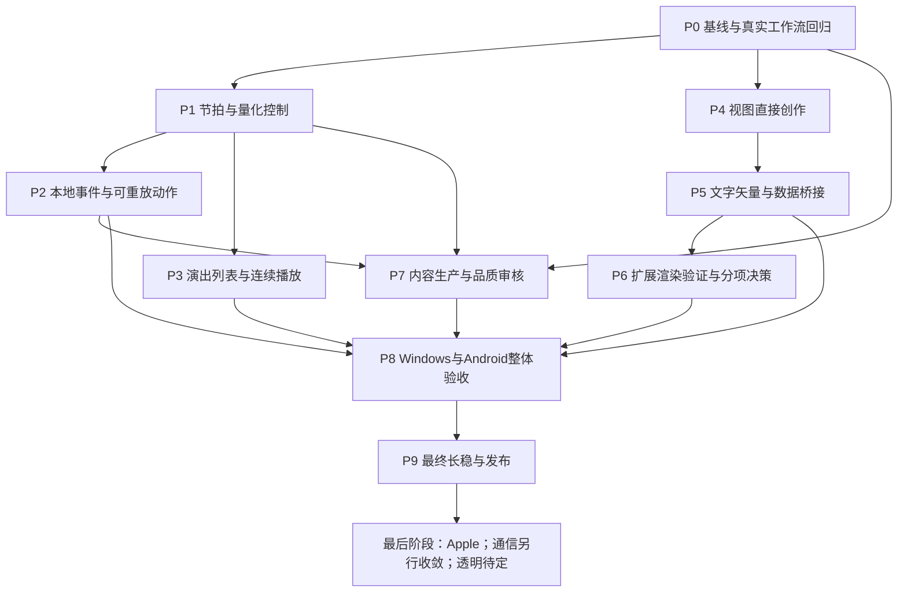

# Rhythm Master 整体实施计划

更新：2026-09-09。代码基线：`69d1423`，含模板切换修复 `8be50ac`。
本文是后续工作的统一执行入口；R0–R6 编号、历史决定和验证记录继续保留。
本次完成的是规划与现状核对，下面的 P0–P9 工作包不因此变成已实现功能。

执行更新：P0.2–P0.3 的工作流 journal、导出阶段、失败用例与跨进程串行入口已交付，
见 [P0 证据](validation/workflow_diagnostics_2026-09-09.md)。P0.1 的基线已核对，
内容审核索引仍随 P7.1 建立。P1.1–P1.2 已完成共享合同与两端原生验证；P1.3 的
Studio/Windows Player 控件和 P1.4 的 Android 控件已实现，实机快照与切场通过。
P1.5 已完成示例、Studio GPU 专项与跨画布方向检查，见
[示例交付证据](validation/beat_studio_example_2026-09-09.md)和
[节拍实施证据](beat_quantization.md)。P2 的事件身份、有界准入、来源/算子、定向重置、
UI 观察、组件和保存发布已交付，见 [事件实施与证据](local_events.md)。
P2.4 可编辑动作轨、现场录制、一次撤销、组件/模板/保存发布及两端实际像素检查
已交付。光幕协奏为 104 节点，三频段事件与可录制动作同时可用；Android 已覆盖
安装并从内置目录选中当前包。期间修复
[Android 旧内容打包漏洞](validation/android_stale_content_2026-09-09.md)。
P3.1–P3.2 的持久演出列表、稳定作品引用、托管副本与两端操作已交付，见
[列表实施与证据](performance_lists.md)。P3.3 常规预算内音画淡化已接入两端，Windows 实际 UI/像素与 Android AAudio
短操作通过，见 [音频切场证据](audio_scene_crossfade.md)。P3.4 分帧 GPU 准备、
队首先准备后 Go、合成目标预热及两端交付已完成，见
[GPU 准备证据](scene_gpu_preparation.md)。P3.5 的显式 GPU/音频超预算硬切、
失败恢复和同一节目单横/竖/横连续演出已交付，含两端实际 UI/输出检查；期间修复
[呈现重置中断下一场准备](validation/presentation_preparation_reset_2026-09-09.md)。
P3 功能工作流收口，声学回录/听感与长稳仍列入最终集成验收，不宣称无缝或采样精确
切场。开始 P4 视图直接编辑；P4–P9、内容品质审核及 P7 数量目标尚未完成。
P4.1 的根图静态 affine 直接编辑已交付，含四种手柄、撤销/取消、完整 Studio
图选择/新输出像素/保存发布重开证据及 Android 共享渲染交付；P4.2 的 ImGuizmo
私有适配器、3D 场景作者事务及根图静态几何拾取已通过鼠标、实际像素和保存重开验证。
P4.3 已接入精确作者路径、共享/独立组件编辑和生成批次保护，含 Studio 实际像素/
保存发布验证；P4.4 的显式固定驱动和曲线数值插帧已交付，含双语言输入、
实际 GPU 固定后拖动、保存发布/撤销重开检查。继续 P4.5 大图导航及输出域检查；
GPU 变形拾取目前明确受限，不把部分视图工作流视为全部 P4 退出验收。
P4.5 导航增量已通过 200/500/1000 节点双语言检查和 Studio 实际搜索/预览像素/
编辑保存发布；下一步完成两份从零创作的退出作品及同作品 Android 验收。
第一份 2D 从零创作示例已接通逐节点添加/配色/命名连接、音乐绑定、视图平移、
组件封装和保存发布重开，并通过同一发布包的真实 PCM/GPU 对比；
详见 [从空画布创作验收](from_empty_authoring.md)。3D 作品、完整视图操作与 Android
同作品验收未完成，不计入 P7 已审核品质数量。
详细范围与未完成部分见 [直接编辑记录](view_manipulation.md)。

## 1. 产品目标、阶段终点与优先级

产品是以音乐可视化为核心的实时节点创作软件，对标 TiXL / TouchDesigner 的
自由组合、节点预览、时间与参数控制、组件复用和作品输出体验。
Studio 是创作主体，Player 运行发布作品。模板是可展开修改的源工程。

本轮主线终点是：**Windows Studio/Player 和 Android Player 完成下列必做工作包，
完成内容目标及正式验收，形成可追溯的交付版本**。不是宣布与竞品全功能等价。
参考范围以本地代码、项目能力目标和实际输出为依据，不宣称审计了 TouchDesigner 源码。

优先级如下：

| 优先级 | 工作 | 执行原则 |
| --- | --- | --- |
| 立即处理 | 错误输出、崩溃、数据丢失、资源失控、用户无法完成的操作 | 先复现、修复、固定回归，再恢复功能主线 |
| 主线必做 | P0–P5、P7–P9：验收基础、音乐演出、自由创作、内容和两端交付 | 按依赖推进，每个增量交付可操作成果 |
| 先验证再确定实现 | P6：材质/compute 扩展与进一步画质能力 | 先完成有边界的可行性结论；未经验证不承诺全部实现、不冻结新依赖 |
| 最后独立阶段 | Apple 移植、通信 | Apple 是最后的平台移植；通信保持停止开发，主线完成后重新核对范围再进入 |
| 最后待定 | 原生透明窗口/后缓冲与点击穿透 | 不阻塞当前交付；图内透明和遮罩不属于该待定项 |
| 范围外 | 桌面壁纸宿主、完整硬件协议生态、任意应用脚本/原生插件环境 | 不作为对标软件的隐含全量需求 |

所有共享契约从现在覆盖目标平台；Apple 无设备期间只做边界审查，不把未测试平台
写成已支持。Android 做 Player，不在手机上铺开节点编辑器。

## 2. 当前基线与尚未闭合的部分

以下由当前源码清单、公共合同和已有验证记录核对，不等于本次重跑全部测试。

| 领域 | 已交付范围 | 后续缺口/边界 |
| --- | --- | --- |
| 节点创作 | 分类、连线、拖动/平移、撤销重做、属性、组件内部编辑、保存重开 | 2D/3D 视图直接操作、更多数据域观察和复杂图工作流仍需完善 |
| 观察与诊断 | 节点内预览、分组调度、最终输出、资源/CPU 统计 | 不把 GPU 低占用当性能结论；8 个活动预览预算不能简单无限放大 |
| 音乐与编排 | 文件/已支持实时输入、音频特征、曲线、宏、快照、Cue、多轨音视频、逐片段源波形 | 手动节拍量化触发、通用本地事件、跨作品音频淡化仍缺；源波形不是最终混音波形 |
| 演出 | 16 项预备队列、双场景 0–5 秒 SDR 溶解、公开宏、Android 全屏 | 队列未持久化；配乐接管是硬切；首次 GPU 创建仍可能形成峰值 |
| 渲染 | R1–R4 的实例/GPU 粒子、浮点/颜色/深度、材质/灯光/阴影/IBL、路径/变形/动画、图像 Shader；FXAA | 均有明确 profile；不等于通用 compute、任意材质、完整矢量文字、HDR 显示或竞品全功能 |
| 资源与交付 | 资产校验/替换/恢复、组件资源复制、运行包、有声 MP4、Windows deploy、Android 内置选择 | 跨增量流程验收、发布材料和更多目标设备覆盖仍需收口 |
| 模板应用 | 宏/快照 ID 重映射已修复；当前计划代次检查已补 | 新增 ID 引用必须同步应用/复制/组件/保存/发布路径，保留每次交付回归 |

实际内容清单：

- `content/templates/*/manifest.json` 共 **45** 个：6 个 Basic、15 个 Advanced、
  1 个显式 Example、23 个未标 tier 的 experimental 示例。后两类在目录中按功能示例看待，
  不能直接计入基础/高级目标。22 个标为 `visual-review-pending`，23 个为 `experimental`。
- 语义组件 **29** 个；原生预设记录 **133**，组件预设记录 **58**，共 **191**。
- 目标仍是 **40 个语义组件、120 个视觉独立合格预设、50 个基础 + 50 个高级合格作品**。
  当前没有建立正式的基础/高级品质验收总数；不能把 6/15 当作已验收数，也不能把 191
  条参数记录当作 120 个合格预设。达到候选数量和达到品质目标分别记账。

主要现有代码落点：

| 责任 | 已有模块/入口 | 后续扩展规则 |
| --- | --- | --- |
| 时间、曲线、宏与 Cue | `src/parameters`，`ControlSequence`；`src/runtime`，`PlaybackClock` | 纯值合同；消费统一时间，不增加设备时钟 |
| 图模型、编译、运行 | `src/graph`、`src/runtime`、`src/editor_application` | 校验在提交前完成；编译/执行代次可追踪；ID 原子重映射 |
| 演出会话 | `src/player_core/scene_queue.cpp`、`scene_deck.cpp` | 保持队列、会话和媒体职责分离；不让 SceneDeck 接管解码器 |
| 媒体与设备 | `src/media`、`src/media_arrangement`、`src/audio_playback`、音频输入输出适配器 | FFmpeg 唯一后端；一个设备消费时钟；私有 RAII 资源 |
| 创作 UI | `src/studio_ui`、`src/editor_application` | 交互草稿与提交分开；显示层不直接修改渲染/解码状态 |
| 三维与后端 | `src/scene3d`、`src/rhythm_render` | 公共项目句柄；Godot 为 3D 首要参考；原生类型留在私有适配器 |
| 存储、发布、内容 | `src/project_io`、`src/assets`、`src/content`、`content`、`provenance` | 工程版本、运行包 ABI、资产闭包和迁移一起处理 |

模块目录与 CMake target 不总是同名，例如 `media_mixer` 的实现位于 `src/media`。
实施前用实际构建图定位；表中的责任不要求为每个任务新建一个库。

## 3. 依赖关系和交付顺序

默认执行顺序是 **P0 → P1 → P2 → P3 → P4 → P5 → P6 的有界验证 → P8 → P9**。
P7 从 P1 起随每批能力生产和审核内容，内容目标未达到不能跳过 P7 宣称 P9 全部完成。
图中的分支表示依赖可解耦，不要求同时启动多个开发代理或同时运行 GPU 测试。
P6 被采用的实现必须完成相应两端验收；验证后暂不采用的项写明限制及后续入口，
不能以“已做可行性验证”宣称功能实现完成。

每个工作包按“合同与复用 → 最小实现 → 模块检查 → UI 操作 → 保存/发布 →
适用的平台验证 → 完整部署 → 记录”拆成可独立回退的提交。
有确切失败才扩大测试；长稳统一在 P9。已过检查且无新增问题，不反复空跑同一轮。

## 4. P0：让完成判据与真实操作一致

对应 R5/R6 的交付基础，优先完成，不开展新的渲染架构改造。

| 编号 | 实施内容 | 交付/退出条件 |
| --- | --- | --- |
| P0.1 | 整理能力、内容和平台状态；区分代码已实现、自动检查、实际画面、品质审核 | 本文基线已整理；后续增加可维护的内容验收索引，历史记录不覆盖当前状态 |
| P0.2 | 保留 `tools/build-windows.py` 四项强制模板回归；补失败时当前/已安装图代次和关键操作证据 | 默认图→选模板→改宏→保存重开→发布过程中，旧输出不得算当前图成功 |
| P0.3 | 整理交付检查入口：Python 调度受影响用例；GPU/UI 检查跨命令串行；失败截图、阶段和日志落盘 | 模板检查缺失或失败即构建交付失败；导出失败能区分启动、准备、渲染、封装和发布 |

P0.2 的模板强制检查已经存在，不重复建设测试框架；新增部分是失败诊断及其他操作
路径的必要补充。波形交付的额外导出检查曾首次未完成、独立重跑成功，根因未确认；
见 [记录](validation/clip_waveforms_2026-09-09.md)。P0.3 补证据后再做一次受控检查，
若仍复现则先修复，不能把重跑一次成功当作该问题已定位。

必查用户回归：节点拖动与端口连线、右键平移光标、窗口尺寸保持、中文指定字形、
复杂图交互、模板当前输出、DLL 完整部署、Android 覆盖安装与画布方向。
这些是持续回归对象；本次规划没有宣称全部已有自动化脚本。

## 5. P1：节拍网格与手动量化切换

用户可将“召回快照/切换下一场”设为立即、下一拍或下一小节，看到待执行目标并取消。
与现有 Cue 编辑吸附区分：Cue 文件当前存秒数，吸附不代表运行时量化已经完成。

| 编号 | 实施顺序与模块 | 具体交付 | 验收重点 |
| --- | --- | --- | --- |
| P1.1 | `parameters` 增加节拍网格值；复用 `PlaybackSample` | BPM、拍号、拍点原点、量化单位；项目元数据及版本兼容 | 边界前/正好边界/边界后、非有限数、低高 BPM、错误拍号 |
| P1.2 | 宿主控制层增加有界待执行动作；复用现有宏和队列操作 | 排队、替换、取消、执行的明确状态；每类动作的稳定请求 ID | 重复点击不重复执行；源代次变化使旧请求失效；不从 UI 开工作线程 |
| P1.3 | Studio 与 Windows Player 接口 | 手动/敲击定速、量化选择、待执行拍点提示；快照/下一场统一行为 | 按钮与画面变更对应同一请求；没有媒体时使用现有本地时钟 |
| P1.4 | Android Player 原生控件使用同一共享合同 | 手机直接量化召回、下一场、取消；状态跨页面切换可见 | 触控、旋转、暂停/恢复、后台返回、重复操作，实际 APK 覆盖安装 |
| P1.5 | 保存/发布与音乐示例 | 一个含快照、Cue、量化切换的可编辑节奏演出示例 | Studio/Player 拍点一致；旧工程保持原来的立即切换默认行为 |

先采用固定 BPM + 原点 + 拍号；精确量化依据已配置网格。已有自动 BPM 估计不能
直接当作准确拍点/小节相位。敲击定速复用成熟本地实现时先记录来源；自动拍点跟踪
需另测置信度、漂移和静音，不把它作为第一版手动网格的前置依赖。

拟定行为合同，实施前写入测试后冻结：

- “下一拍/小节”指请求时间之后的边界；落在边界的请求不追溯到已经提交的帧。
- 暂停时不执行；恢复按同一媒体时间继续。seek、重启、换音乐/工程取消旧待执行项。
- 修改 BPM/拍号/原点取消旧量化项并显示原因，不静默重排已经保存的秒制 Cue。
- 视觉动作在第一个跨过目标时间的显示帧生效；音频消费仍以采样时间为准，
  不宣称所有刷新率下的像素变化都能采样精确。测试在多个刷新率下检查不早于目标、
  不晚于一个正常显示帧；停顿另记，不用低帧率掩盖调度错误。
- 无配乐时使用现有本地时间；没有可靠拍点时明确使用手动网格，不伪造自动同步。

## 6. P2：有界本地图事件与可重放动作

先补能用于音乐创作的有限动作：触发包络、计数/步进、门控/锁存、重置指定模拟状态。
不引入网络事件、任意脚本或从图中调用文件/进程的能力。

| 编号 | 工作 | 模块与验收 |
| --- | --- | --- |
| P2.1 | 定义时间戳、来源、稳定序号、作用域和代次；事件与持续数值分离 | `graph`/`runtime`/`parameters`；同一时刻稳定排序，重复 ID 去重策略明确 |
| P2.2 | 有界事件队列与首批算子；明确事件循环规则 | 每帧/队列预算先以小型探针测定；建议初始上限作为草案记录，不冒充既有支持值；无延迟环拒绝或强制下一帧，禁止无限递归 |
| P2.3 | 节点事件预览、组件端口、历史事务、schema/ABI 和发布 | 插入/复制/模板实例化时重映射引用；删节点/拆组件/撤销不得留下悬挂目标 |
| P2.4 | 可编辑动作轨和现场动作录制的最小范围 | 只录本项目类型化动作、媒体时间与目标；保存后离线按同一规则重放，未录制现场输入不假装可复现 |

事件来源先接 P1 网格、现有 Cue 前向越界查询和已有音频瞬态特征。
连续播放、重复时刻、倒退定位、循环和暂停分别定义：定位只重建当前可确定状态，
不补发一路跳过的现场副作用；循环使用新代次。粒子/反馈重置保留原有有状态限制，
不能仅依赖 Cue 数值可求值就承诺任意 seek 等价于从头模拟。

退出作品：低频触发粒子爆发、中频推进步进图案、高频触发短包络；静音时有可解释
的待机画面。真实音乐、静音与分频对照后，录制一段动作并核对实时/导出顺序。

## 7. P3：演出列表、音频淡化与切场准备

| 编号 | 工作及依赖 | 实施落点 | 退出条件 |
| --- | --- | --- | --- |
| P3.1 | 持久演出列表；依赖现有队列，量化设置依赖 P1 | `project_io` 的版本化演出文档 + `player_core` 队列适配 | 保存/重开/排序/删项/重复作品/缺失资源可恢复；持久化描述不含线程和 GPU 句柄 |
| P3.2 | 稳定作品引用和内置目录迁移 | 内容 ID + 版本/资产身份；导入包采用应用管理副本 | 不持久化 Android 临时缓存绝对路径；内置内容升级后能解析或明确提示缺失 |
| P3.3 | 跨作品配乐交叉淡化；复用 `AudioMixer` 与既有输出队列 | 媒体游标/过渡包络归媒体层，`SceneDeck` 只消费时间和状态 | 两首不同采样率/长短/编排音乐可过渡；一个设备时钟，无双播放器漂移；取消和失败能回到当前场 |
| P3.4 | 分阶段 GPU 准备与峰值控制 | `PreparedPackage` → 可取消准备需求 → 渲染线程资源创建 | 先测首次创建峰值；分帧上传按预算推进，只有可呈现时才允许切场；不能用多线程直接触碰 Renderer |
| P3.5 | Windows/Android 演出工作流 | 队列、量化、音画过渡、暂停/seek、恢复状态及场景方向 | 一套列表连续运行不同画布/配乐作品；资源失败保留旧场，并显示确切原因 |

音频合同先明确再实现：

- 第一版两场使用过渡后的同一混合 PCM 特征；避免同时建立两条未经定义的节拍基准。
  后续若要各场独立分析，单独扩展合同与预算。
- 优先比较已有包络实现和本地上游交叉淡化算法。线性/等功率选择需做已知信号和
  听感对照，统一限幅；不能把等功率直接视为任意相关信号都不超峰值。
- 当前每份编排最多 4 路重叠，不允许过渡时默认变成无限或未经验证的 8 路。
  首版按全局 4 个活动解码游标评估准入；超预算拒绝该淡化并保留当前播放，
  用户可明确选择硬切。确需提高上限时先做两端峰值探针再修改合同。
- 两场共用现有 256 MiB 纹理和 240 个离屏 pass 预算，不给每场各发一份预算。
  停止/取消/错误/后台释放都必须归还已准备资源。
- 自动按节拍切换依赖 P1；演出列表保存不依赖通用 P2 事件完成。
  演出列表整场录制/导出如需增加，单独列下一增量，现有单作品导出先保持正确。

## 8. P4：在视图里直接创作

| 编号 | 工作 | 实施边界和验收 |
| --- | --- | --- |
| P4.1 | 2D 画布移动/旋转/缩放、枢轴和吸附 | 复用编辑事务；屏幕→画布坐标包括缩放、留黑、DPI、横竖屏；不因拖动物体而平移整个节点图 |
| P4.2 | 3D 对象选择与变换手柄 | ImGuizmo 仍是候选；先查 vcpkg 版本和现有 ImGui 兼容性，再做透视/正交/局部/世界轴验证；公共 API 不暴露库类型 |
| P4.3 | 层级/实例/组件编辑语义 | 稳定对象身份映射到作者节点；明确“改一实例”还是“改共享源”；不允许把程序生成的中间网格直接写回资产 |
| P4.4 | 自动化参数的直接编辑策略 | 常量可编辑；表达式/绑定/曲线驱动时提示来源，提供显式修改常量或记录关键帧操作；不静默覆盖绑定 |
| P4.5 | 大图导航与预览检查 | 选择定位、上下游/组件定位、聚焦不同输出域；按实际缺口补功能，保留已有分类/帮助/预览组；拖动、取消、切域、撤销均检查 |

一次拖动只生成一次历史事务；Esc 放弃草稿，鼠标释放提交；失去焦点有明确取消策略。
父节点负缩放/非均匀缩放、不可逆变换、不可见/离屏对象必须有测试，不能以一个原点
立方体的成功代替完整变换合同。

退出作品：从空图搭建 2D 音乐构图和 3D 音乐雕塑，通过视图调整位置、尺寸和方向，
封装组件、保存重开、发布，在 Android 验证结果一致。Android 不提供这些编辑手柄。

## 9. P5：文字、矢量与数据域桥接

| 编号 | 工作 | 实施路径与限制 | 可见交付 |
| --- | --- | --- | --- |
| P5.1 | 可渲染的文字节点 | 先核对现有字体、FreeType 和 vcpkg；HarfBuzz/ICU 保持候选，按排版需求验证；字体/字形缓存与图纹理解耦 | 中文/英文标题、行距/对齐/换行、音乐驱动位置和颜色 |
| P5.2 | 文字资产与输入体验 | 字体出处/授权、缺字回退、IME 输入与保存；动态文字采用有界重排/字形上传 | 指定“棱镜星莲”等字符和混合标点显示正确，工程/包/两端保持可用字体 |
| P5.3 | 基础矢量路径、填充与描边 | 复用现有 Path/曲线；曲线扁平化、细分/三角化先找成熟实现；孔洞/连接/端点/预算明确 | 可编辑标志、轮廓和频谱路径；SVG 导入只在子集/许可/解析预算验证后增加 |
| P5.4 | 纹理/信号/点/路径之间的显式转换 | 先做频谱→点/路径、纹理采样→点属性的作品所需最小集；类型、坐标和采样预算固定 | 同一音乐信号能驱动图像、几何和文字排布 |
| P5.5 | 预览、缓存和资产发布 | 缓存键含字体/布局/源版本；局部修改不全图重建；为新类型补 viewer 和运行包能力声明 | 无外部目录依赖的音乐标题片和矢量演出图，Windows 导出/Android 播放 |

不在本阶段承诺完整富文本编辑器、任意 SVG/HTML/CSS、排版软件或无限文字几何化。
文字的语言布局与字体字形覆盖分别验收；“UTF-8 可解码”不代表屏幕文字正确。
保留用户已确认恢复的现有 UI 字体；作品中的文字字体可以作为明确资产配置，
不以新增文字节点为由再次全局替换编辑器字体。

## 10. P6：进一步渲染能力的验证与分项定案

本阶段先交付真实可行性结论，修订专项合同后才实现被采用能力。
R0–R4 已完成的受限 profile 不撤销，也不改写为已经覆盖下面的通用扩展。

| 编号 | 候选方向 | 验证输入与必须回答的问题 | 通过后的实现路径 |
| --- | --- | --- | --- |
| P6.1 | 用户材质 Shader | 纹理/法线/光照/阴影绑定能否复用现有材质语义；错误热更与旧包拒绝 | 受约束表达式→类型检查→双后端编译→原子替换→可编辑材质作品 |
| P6.2 | 更通用的 GPU 属性/compute | 现有粒子状态之外的有界缓冲布局、读写同步、越界拒绝和设备 profile | 从一个点属性处理实例起步；不暴露任意原生缓冲/命令，也不默认 GPU→CPU 同步读回 |
| P6.3 | 透明合成与抗锯齿 | 先以相交透明物体、细线/运动几何判断现有排序/FXAA 的具体不足，再比较适合当前后端的方案 | 只采用有作品收益且两端预算成立的方案；TAA/MSAA、OIT 不整套同时铺开 |
| P6.4 | 附加输出与复杂图调度 | 现有深度外的法线/对象 ID 等是否有实际消费者；请求裁剪、生命周期、预览与资源成本 | 按需声明输出，延续当前显式颜色/深度模型；不为所有场景强制建立完整 G-buffer |

每项产出“采用/限制采用/暂不采用”记录，包括 Windows 与目标 Android 的实际结果、
开源来源、维护成本、格式影响、回退行为和阻塞条件。HDR 显示/编码、完整材质语言、
通用计算环境仍需各自定案。某项不通过不无限拖住其他独立功能和内容制作。

## 11. P7：组件与作品生产，贯穿功能阶段

### 11.1 独立记账和来源

为每个内容 ID 记录：类别、版本、源工程/资产哈希、所用能力、原创/复用来源、
公开控件、功能检查、实际音乐检查、视觉审核、设备/画质档位、缺陷及修订记录。
状态至少区分 `authored`、`functional_pass`、`visual_review_pending`、
`visual_accepted`、`device_validated`；这些是规划字段，不是当前已实现的 schema。
修改 manifest 前先做兼容迁移设计，或先在独立审核索引记录。

工程可直接生成、改编、复用成熟开源节点和效果；先审实际源码/Shader 及所包含的
第三方代码，保留来源和许可。商业演示可作为构图/运动目标，不把看到演示当成复制
其代码、音乐、模型或贴图的许可；用自有素材或合规开源材料制作。

### 11.2 目标作品分布

以下是产能与风格覆盖配额，不是已经存在的 100 份作品名称；每格 5 个独立构图。
现有候选可修改后纳入，不能因曾通过运行检查就自动填满配额。

| 家族 | 基础 × 5 | 高级 × 5 |
| --- | --- | --- |
| 频谱构图 | 环、线、面、对称和留白构图 | 多层频段结构与阶段演化 |
| 文字与版式 | 中文标题、节拍字形排布 | 几何/粒子/文字结合的动态标题演出 |
| 几何节奏 | 可直接编辑的图形编排 | 多轴节奏雕塑和空间构图 |
| 矢量与轮廓 | 描边、轮廓、路径呼吸 | 多层路径重组与节拍切换 |
| 粒子与轨迹 | 完整前后景的尘埃/火花 | GPU 场、发射变化、轨迹与高潮段落 |
| 流体感与有机纹理 | 有意图的颜色/形态运动 | 反馈/位移/Shader 组合与结构变奏 |
| 光学与抽象空间 | 玻璃、棱镜、遮罩等简洁构图 | 空间折射、隧道、交错光场 |
| 材质与雕塑 | 单主体、清晰材质灯光 | 多部件动画、阴影/环境光和音乐形变 |
| 图像与视频 | 可替换素材的音乐画框 | 多轨视频、遮罩、转场与片段编排 |
| 建筑与舞台 | 场景节奏和空间层级 | 多场组合、Cue 和可演出的复杂空间 |
| 合计 | 50 | 50 |

独立性按空间组织、形态结构、运动规律和音乐映射审核；颜色、分辨率、横竖版、
设备降级版和只改参数的同一结构不重复计数。Basic 降低操作门槛，仍要求成品画质；
Advanced 必须有实质更丰富的结构与时间发展，不能靠堆节点数取得分类。

### 11.3 批次和退出标准

| 编号 | 工作 | 批次交付 |
| --- | --- | --- |
| P7.1 | 审核索引与现有内容复核 | 先挑 2 基础 + 2 高级校准品质标准；其余旧候选维持待审，不擅自改成用户验收通过 |
| P7.2 | 组件从 29 补到至少 40 | 从节拍控制、几何/文字、矢量处理、图像处理和演出组合中补实际缺口；每个有独立用途、演示输入、公开控件及可编辑内部结构 |
| P7.3 | 基础/高级作品分批制作 | 候选累计目标依次 5/5、15/15、30/30、40/40、50/50；按审核反馈持续修订，最终需合格数各 50 |
| P7.4 | 预设独立性复核 | 191 条现有记录分类去重，补到 120 个视觉独立合格预设；节点默认值记录可保留但不自动算品质作品 |
| P7.5 | 每批打包与平台交付 | 实际 GPU 缩略图、动态预览、源工程和绑定音乐；UI 选择/改控件/换资源/保存/发布/两端播放，适用时有声导出 |

每个音乐作品至少检查静音、低/中/高频变化、不同响度、段落发展、参数极端值和
换一首真实音乐后的响应。使用有明确来源的音乐/合成素材；合成特征像素对照用于
算法回归，不能替代真实音频播放。必须实际查看动态效果，截图不能证明运动品质。

每批功能完成就生成短演示材料和待审列表，审核反馈可异步进入下一批；不因等待
可选审美反馈停止独立功能开发，也不能在没有验收证据时自行标记用户已通过。

## 12. P8：Windows 与 Android 完整工作流验收

| 编号 | 工作流 | 必须验证的实际路径 |
| --- | --- | --- |
| P8.1 | 从零创作 | 空图→加节点→连线→接音乐→观察节点/最终输出→封装组件→修改内部→撤销→保存重开 |
| P8.2 | 模板修改交付 | 已有工程→连续选不同模板→宏/快照/事件 ID 重映射→换素材→发布→Player→有声导出 |
| P8.3 | 连续演出 | 列表重开→准备→量化切场→音画淡化→缺失资产/超预算失败→重试→暂停/定位/循环 |
| P8.4 | Android 应用 | 覆盖安装后保留数据→内置 UI 选择→真实音乐→公开控制/队列→横竖屏→音频焦点/权限/前后台/图形资源重建 |
| P8.5 | 性能与能力报告 | 代表性小/中/大图的编辑和播放，记录 CPU 各阶段、可取得的 GPU 耗时、内存/纹理、节点预览需求与预算；对具体瓶颈修复 |

大图首先使用有意义的 200/500/1000 节点测试工程检验布局/选择/预览调度，其中纯
编辑压力图和全图运行压力图分开；超出当前运行 profile 的规模预期应为明确拒绝，
不是强行要求全部执行。实例/粒子使用已有 1 千/1 万档及已支持 profile，不以人为
增加空节点或无用 pass 冒充复杂音乐作品。节点数量、执行指令数和实际可见需求分别记录。

性能目标先复用现有质量档位和设备基准，缺项先测定再写固定阈值。报告 p50/p95、
峰值、分辨率、画质、音乐输入、设备和驱动；CPU 时间不当 GPU 时间，不承诺所有手机
60 FPS。若无可靠 GPU 计时明确标记缺失，不能用任务管理器百分比替代。

平台验收矩阵：

| 平台 | 当前作用 | 每个相关增量 | 本轮最后 |
| --- | --- | --- | --- |
| Windows Studio | 主创作产品 | 受影响模块、真实 UI、节点/最终输出、存储发布、Python deploy | 全工作流、复杂图、发布包、长稳 |
| Windows Player | 独立运行/演出 | 新包/宏/事件/媒体/队列、窗口与全屏 | 同一作品与 Studio/导出对照 |
| USB Android | Player；当前证据来自 Redmi K40S / Adreno 650 | 共享契约 NDK 构建、必要原生 GPU/媒体检查；应用改变时 APK 覆盖安装并走实际 UI | 音频焦点、方向、生命周期、档位、长稳/热状态 |
| 更多 Android 设备 | 不从现有单机结果推断 | 有设备再增加代表性 GPU/系统配置 | 未测设备保持“未验证” |
| macOS/iOS | 最后移植，现无 Apple 设备 | 只审共享边界与能力元数据 | 不伪造编译/Metal/签名/实机验收 |

## 13. P9：功能结束后的长稳和发布

只有 P0–P5、P7、P8 已满足退出条件，P6 每项已形成可追踪决定且被采用实现已验收，
才进入本轮最终收口。已知输出错误和数据问题不带入“等长稳再看”。

| 编号 | 工作 | 交付与完成条件 |
| --- | --- | --- |
| P9.1 | 集中稳定性/热测试 | 固定候选版本、作品集、设备、分辨率和质量档位；记录内存/纹理趋势、音画漂移、切场次数、后台恢复及温度/降频影响 |
| P9.2 | 失败修复与复测 | 每个失败关联最小复现和修复提交；只重测受影响场景及必要系统回归，保留失败日志，不靠重跑择优 |
| P9.3 | 发行材料 | 完整 Windows deploy、Android APK、源码版本、依赖/许可/构建材料、包/内容清单、能力矩阵、已知限制与用户验收记录 |

拟定首轮长稳矩阵为 Windows 创作/演出各 2 小时、Android 播放/切场 2 小时及一次
前后台/旋转序列；通过后再选择代表作品做 8 小时运行。具体时长和阈值在进入 P9
时结合已有长稳证据冻结，不在每个功能提交后提前执行，也不重复无变化的已有证据。

各可分发产物的依赖和许可证材料沿用 [复用规则](third_party_reuse_policy.md)。
项目对外许可证尚未选择；规划不代用户选定，不把测试包已生成等同公开发行条件已齐。
涉及产物许可决定时先准备具体依赖/链接和分发材料，再解决对应决定；这不阻塞其他
独立功能的本地开发，也不额外恢复通信模块。

## 14. 最后阶段与长期扩展

| 项目 | 进入条件 | 实施顺序 | 不能提前声称 |
| --- | --- | --- | --- |
| Apple | Windows/Android 主线交付；获得 Apple 构建环境及实机 | macOS 共享核心/Metal 探针→Studio/Player→字体/IME/音频/导出→iOS Player/权限/生命周期→签名与实机验收 | 仅阅读平台抽象不等于移植成功；缺设备只阻塞 Apple 实机项 |
| 通信 | 当前停止状态保持至主线完成，届时先复核最小需求与已有试验 | 先盘点已有代码和协议证据，再收敛最小控制/时间/输入快照；可靠控制与时效输入按实际验证定案 | 不默认 QUIC 已最终冻结，不因有扫码原型宣称分布式演出完成 |
| 透明原生输出 | 整体最后仍有明确用途时再评估 | 单独验证后缓冲、窗口合成和输入策略 | 不回到壁纸产品设计，不阻塞普通窗口输出 |
| 其他扩展 | 出现具体作品或工作流需求 | 保调变速、任意演出列表整场导出、更多渲染/输出域等按独立合同排队 | 不因竞品存在而无限扩大本轮完成口径 |

Apple 与通信都后置；本计划不擅自规定两者必须相互等待。没有 Apple 设备不会让
已可继续的 Windows/Android 工作回退，通信的恢复也不能绕过用户已明确的停止优先级。

## 15. 复用、工程和验证纪律

### 15.1 复用顺序

1. 查现有项目模块与实际测试，避免重复实现已交付能力。
2. 阅读本地上游源码：TiXL/ossia 的时间与动作、Godot 的三维/变换、Material Maker
   的图像/路径/Shader，记录实际文件与依赖，不只引用仓库名称。
3. 所有依赖及工具先检查 `C:/source/vcpkg` 的对应 triplet、版本、features、ABI 和许可。
   例如 ImGuizmo/HarfBuzz 是候选，某个 triplet 已安装不代表两端接入已验证。
4. 优先直接复用、聚焦抽取或适配；确需自写时记录具体不兼容点。
   GPL 等按受影响产物的实际条款判断，不一刀切，也不凭包装层免除义务。
5. 来源 URL、revision、文件、许可/例外、改动、目标模块和必要材料进入 `provenance`。
   不修改旧项目、原始 GammaRay 或上游参考仓库。

### 15.2 单个增量的完成证据

| 层级 | 必要证据 | 不可替代它的结果 |
| --- | --- | --- |
| 合同 | 合法/非法输入、边界、ID/代次、取消与资源预算 | 只有正常样例或实现镜像断言 |
| 作者操作 | 真实入口、点击/拖动/修改、当前图和实际画面、保存重开 | 直接构造最终图或预先写好工程 |
| 媒体/视觉 | 真实 PCM 输入、静音/频段差异、动态观察、适用的音画导出 | 编译通过、静态截图、合成特征单测 |
| 平台 | 本次构建、原生检查、应用 UI 和安装分别记录 | NDK 编译代替手机应用验收 |
| 品质 | 独立构图/运动/音乐响应及审核记录 | 节点数、预设条数、GPU 占用低 |

记录至少包含代码提交、测试版本、设备/分辨率/profile、图及运行包身份、实际操作、
输入素材身份、预期、实测、失败及修复、日志/图片/视频位置、剩余限制。
计划中的判据不能填写为已测结果；失败不只写“重跑通过”。

工程纪律继续执行 AGENTS：智能所有权/值语义、声明初始化、Google 命名、4 空格、
模块职责与平台边界；新增代码警告视为缺陷。重命名在一个可构建模块内原子完成。
默认 20 worker 增量构建，不清缓存。工具和部署使用 Python，CMake 只负责构建配置
及调用；每次 Studio 交付执行强制模板检查并复制完整资源/DLL 到同级 deploy。
Android 更新仅 `adb install -r`，不卸载/清数据；内置效果始终通过 UI 选择。

### 15.3 状态、阻塞与变更

每个工作包用“未开始 → 合同/验证中 → 实现中 → 集成检查 → 已交付”标记，
另记品质/平台未验证项；没有完成退出条件不标记交付。各包当前进度以本文开头的
滚动状态及对应专项验证记录为准；已有复用基础以第 2 节及历史记录为准。

发现缺陷先处理关联路径；缺设备/许可决定/无法验证的第三方能力只阻塞依赖它的项，
继续有独立价值的工作。不要为普通实现选择反复请求批准；也不能把等待当作用户
同意、把候选库变成冻结依赖或无限拓展范围。

不提供未经测量的完成日期。以每个可演示增量的退出条件安排顺序；P1 第一批交付后，
根据真实跨模块/设备验证成本补滚动工期评估，内容制作和视觉修订单独估算。

## 16. 紧接着执行的提交队列

| 顺序 | 对应任务 | 提交内容 | 进入下一项的条件 |
| --- | --- | --- | --- |
| 1 | P0.2–P0.3 | 补真实工作流失败诊断，导出阶段证据，串行验收入口；保留现有模板必测 | 首次失败可追踪，受控用例通过或缺陷已修复 |
| 2 | P1.1 | 节拍网格合同与边界检查，不接 UI | 时间/拍号/边界/代次行为通过 |
| 3 | P1.1 | 工程节拍元数据、迁移和包合同 | 旧工程与新工程往返、默认行为兼容 |
| 4 | P1.2 | 有界量化动作状态机，调用现有宏/切场事务 | 暂停、取消、重复点击、定位、改 BPM 和换源通过 |
| 5 | P1.3 | Studio/Windows Player 控件与实际操作测试 | 点击后按目标拍点改变当前输出，保存重开无错 |
| 6 | P1.4 | Android 控件和共享动作桥接 | APK 覆盖安装后实际 UI 量化切换/取消/恢复通过 |
| 7 | P1.5 + P7.1 | 第一份可编辑量化演出示例、真实音乐和动态证据 | 两端效果、公开控件、来源和审核状态清楚 |
| 8 | P2.1 | 开始类型化本地事件合同及首批触发节点 | 先完成纯合同和有界调度，再接 UI/组件/发布 |

后续按 P2→P3→P4→P5 推进，每批穿插 P7。此队列替代旧文档中已经过时的
“接下来补 GPU 粒子/材质/波形”等历史下一步，不删除那些功能的原始验证记录。

## 17. 文档关系

- [产品定位](product_scope.md)：目标与范围的上位约束。
- 本文：当前工作包、依赖、交付和完成判据的执行入口。
- [R0–R6 路线与记录](rendering_capability_roadmap.md)：保留原规划及逐批证据。
- [架构](architecture_overview.md)、[技术栈](technology_stack_evaluation.md)、
  [复用政策](third_party_reuse_policy.md)：模块、依赖、来源约束。
- [创作差距基线](feature_gap_review_2026-09-08.md)：历史对照，不能覆盖当前已完成项。
- [内容质量](template_quality_delivery_plan.md)：独立性、数量与品质审核规则。
- `docs/validation/`：实际检查结果；尤其保留
  [模板切换与漏测复盘](validation/template_switch_regression_2026-09-09.md)。

发生顺序变更时同步本文和相关专项页的入口/状态；不继续增加互相矛盾的“当前下一步”。

### P1.1 节拍元数据增量（2026-09-09）

纯网格及敲击定速之后，已接通根图/组件展开/执行计划、工程 schema 6、运行 ABI 4。
未配置网格保持旧格式。Windows 图、编解码、真实保存重开发布、模板历史检查，以及
USB Android 原生编解码和编辑合同通过；详见 [节拍合同](beat_quantization.md)。
P1.2–P1.5 尚在推进，不将元数据完成视为量化演出功能完成。
